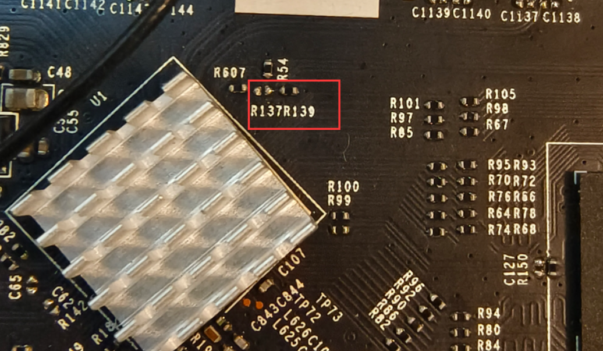
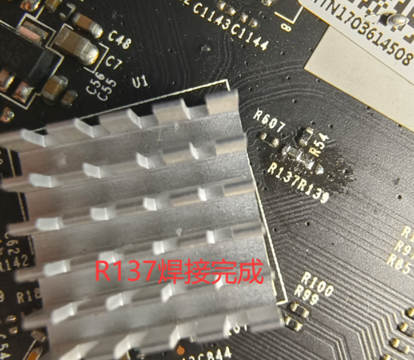
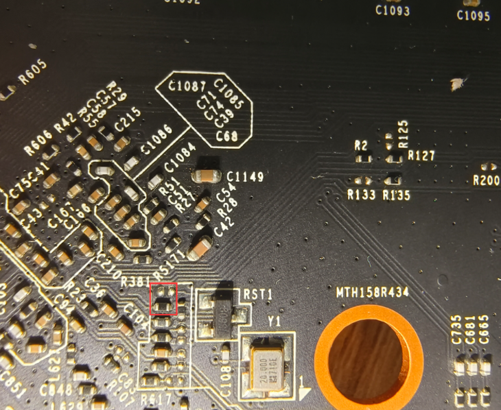
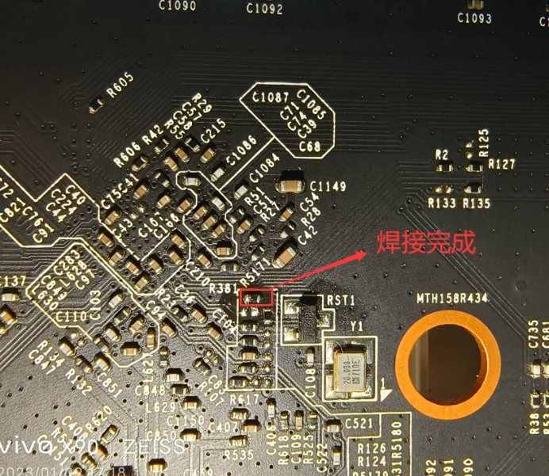
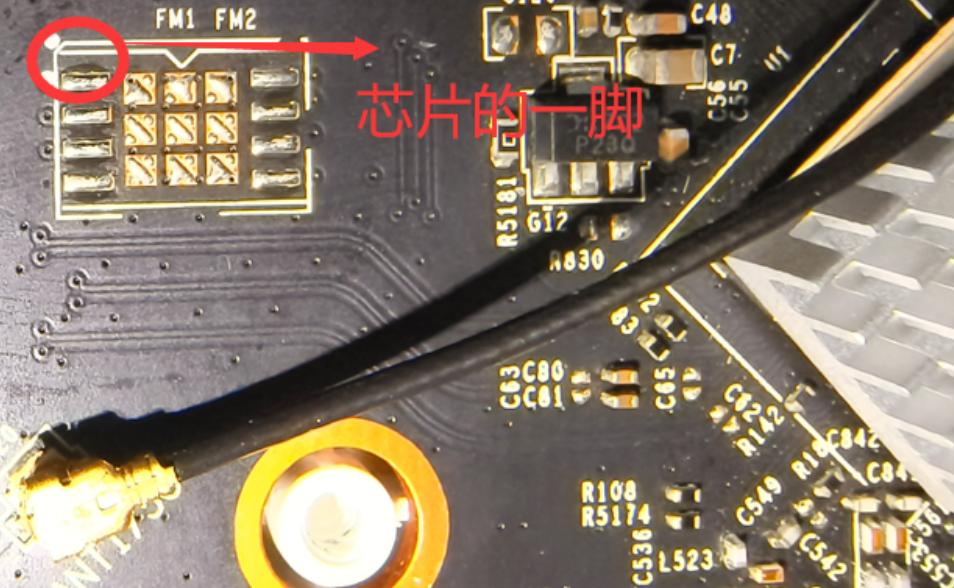
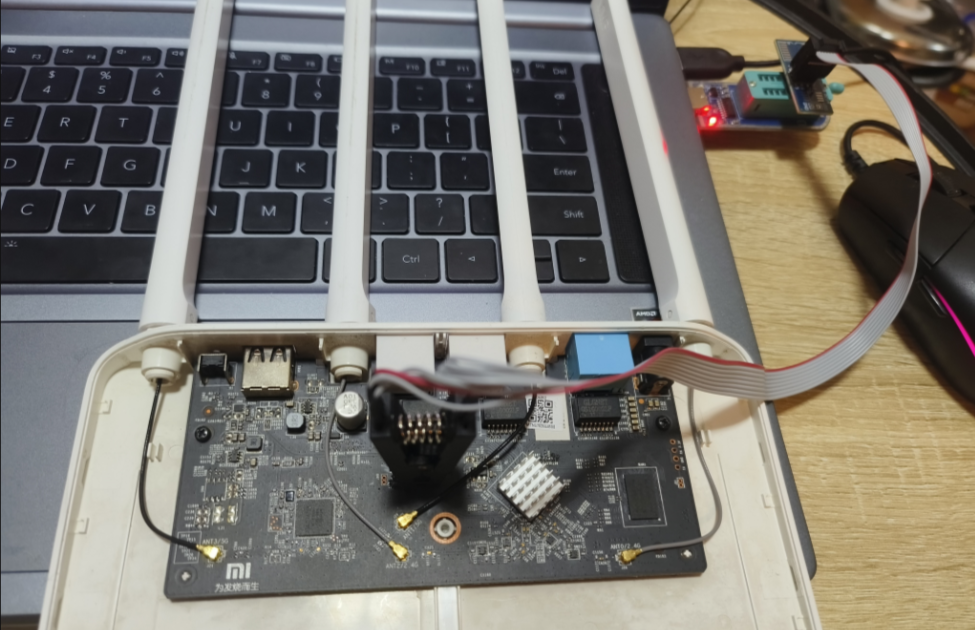
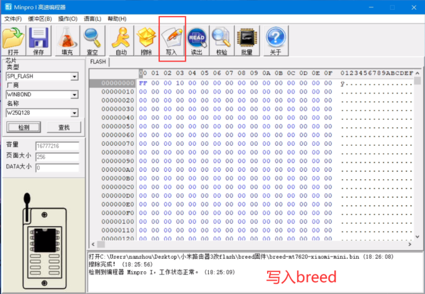

# 小米路由器3 Mi3R SPI Flash硬改 & OpenWrt救砖刷机

> 文档用途：解决小米路由器3 NAND变砖，TTL无法救砖，通过硬改SPI Flash+编程器刷Breed救砖，刷入OpenWrt固件。

## 一、硬件准备清单

- 小米路由器3（Mi3R）主板
- SPI Flash芯片（W25Q128，16M）
- T48/CH341A编程器 + SOP8 SPI测试夹子
- 电烙铁、助焊剂、洗板水、万用表
- 杜邦线、Windows电脑（编程器上位软件）

## 二、主板硬件修改（关键焊接步骤）

### 2.1 主板正面 R137 / R139电阻迁移
把R139电阻拆下，移动焊接到R137位置，切换启动模式信号。

> 图：散热片附近R137、R139原始位置

> 图：R137焊接完成效果图

### 2.2 主板背面电阻调换 R124 ↔ R126
主板圆孔Y1附近，R124拆移到R126焊盘，完成SPI/NAND硬件切换。

> 图：主板背面需要改动的电阻区域

> 图：背面电阻改完效果

### 2.3 焊接SPI‑Flash芯片 

1. PCB板上FN1圆点标记，代表芯片第一脚，芯片圆点要和PCB圆点对齐，方向千万不能反。

> 图：主板SPI空焊盘，FN1标记第一脚

2. 推荐优先：编程器夹子先烧录Breed，烧录完成再焊上主板。
3. 直接焊接芯片，焊完万用表测VCC‑GND，确认无短路再上电。

⚠️ **警告**：焊接完成务必测量，短路会直接烧毁主板。

## 三、编程器烧录 Breed

1. SOP8夹子夹到SPI芯片，夹子红色线对应芯片第一脚。

> 图：夹子在线烧录实物，不用拆下芯片

2. 打开编程器软件，点击检测，识别W25Q128；识别失败重新压紧夹子。

> 图：编程器上位机成功识别Flash芯片

3. 完整擦除Flash全部内容。
4. 载入 `breed‑miwifi‑r3‑mini.bin`。
5. 执行写入，写入结束必须校验，校验100%才算烧录成功。

## 四、路由器进入Breed

1. 网线接路由器白色LAN口接电脑网卡。
2. 按住复位按键不放，接通电源，保持5‑8秒松开。
3. 电脑设置静态IP `192.168.1.x`，浏览器访问 `http://192.168.1.1`，进入Breed控制台。

> 💡提示：Breed中建议完整备份全Flash镜像，防止后续变砖。

## 五、刷写 OpenWrt

1. Breed页面 → 固件更新，选择Mi3R‑SPI专用OpenWrt固件。
2. 取消勾选保留配置，点击更新，等待自动重启。
3. 重启后访问OpenWrt地址 `192.168.1.1`

## 六、常见故障排查

- 编程器识别不到芯片：夹子接触不良、第一脚接反、虚焊、芯片损坏。
- 上电无法进入Breed：电阻焊接错误、芯片方向颠倒、存在电源短路。
- Breed正常，刷完OpenWrt无法启动：固件必须是SPI版本，不能用原版NAND固件。

---

## 相关文件下载

- breed‑miwifi‑r3‑mini.bin
- Mi3R‑SPI编译OpenWrt固件

---
文档来源：Openwrt‑Mi3R‑SPI Project
